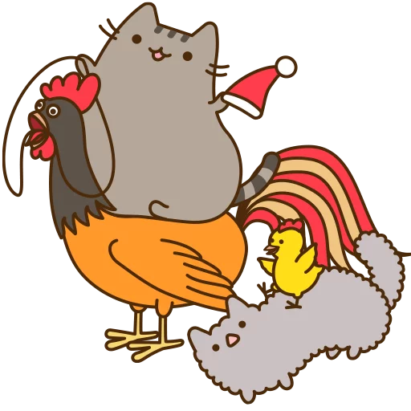

# CoqCat

CoqCat is a formalization in [Coq](https://coq.inria.fr) of [axiomatic memory models](http://www0.cs.ucl.ac.uk/staff/j.alglave/these.pdf). These models can already be designed, simulated and tested against real hardware using the tools of the [DIY Toolbox](http://diy.inria.fr).

The goal of this development is to formalize these memory models and to prove interesting properties about them.

## Installation

To compile the project, run `make`.

If you want to generate the documentation using coqdoc, run `make html`.

## License

The author of CoqCat is Jade Alglave.

Copyright 2010 Institut National de Recherche en Informatique et en Automatique. All rights reserved. This file is distributed under the terms of the Lesser GNU General Public License.

---

